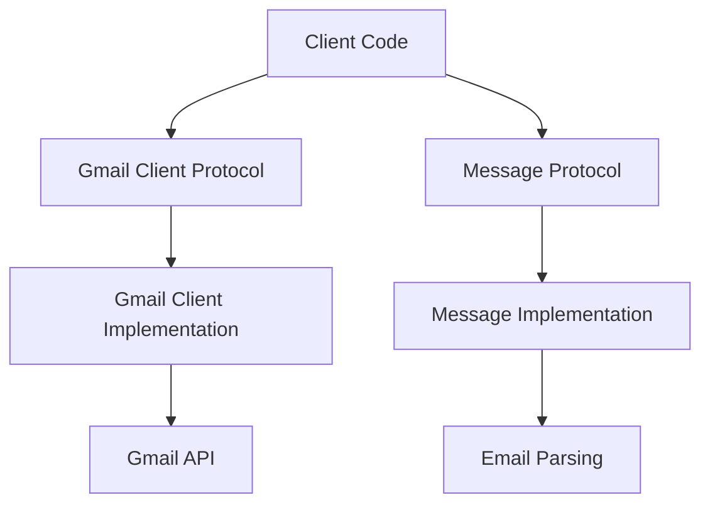

# Gmail Client

A professional, reusable Gmail client library with comprehensive CRUD operations built following modern Python best practices.

## Features

✨ **Protocol-based Design** - Easy testing and extensibility with Python protocols  
📧 **Complete CRUD Operations** - Read, send, delete, and mark messages as read  
🔐 **OAuth 2.0 Authentication** - Secure credential management  
🧪 **Comprehensive Testing** - Unit, integration, and end-to-end tests  
📊 **Type Safety** - Strict MyPy checking for reliability  
⚡ **Modern Tooling** - UV, Ruff, and automated CI/CD

## Quick Example

```python
from gmail_client import get_client

# Initialize client
client = get_client()

# Read messages
for message in client.get_messages():
    print(f"From: {message.from_}")
    print(f"Subject: {message.subject}")

# Send a message
client.send_message(
    to="recipient@example.com",
    subject="Hello!",
    body="Message sent from Gmail Client"
)
```

## Architecture Overview

The library follows a clean architecture pattern with protocol-based interfaces:



## Why Choose Gmail Client?

- **Reusable**: Import directly as `from gmail_client import get_client`
- **Testable**: Protocol-based design enables easy mocking
- **Professional**: Following industry best practices and patterns
- **Maintainable**: Clear separation of concerns and comprehensive documentation
- **Reliable**: 85%+ test coverage with multiple test types

## Getting Started

1. **[Installation](guide/installation.md)** - Set up the library and dependencies
2. **[Authentication](guide/authentication.md)** - Configure Gmail API access
3. **[Usage Examples](guide/usage.md)** - Learn the core functionality
4. **[API Reference](api/client.md)** - Detailed method documentation

## Project Status

- ✅ Core CRUD operations implemented
- ✅ OAuth 2.0 authentication
- ✅ Comprehensive test suite
- ✅ Type-safe implementation
- ✅ Professional documentation
- ✅ CI/CD pipeline

## Contributing

We welcome contributions! See our [Contributing Guide](development/contributing.md) for details on:

- Setting up the development environment
- Running tests and quality checks
- Submitting pull requests

## License

This project is licensed under the MIT License - see the [LICENSE](https://github.com/prathamssaraf/ta_assignment/blob/main/LICENSE) file for details.